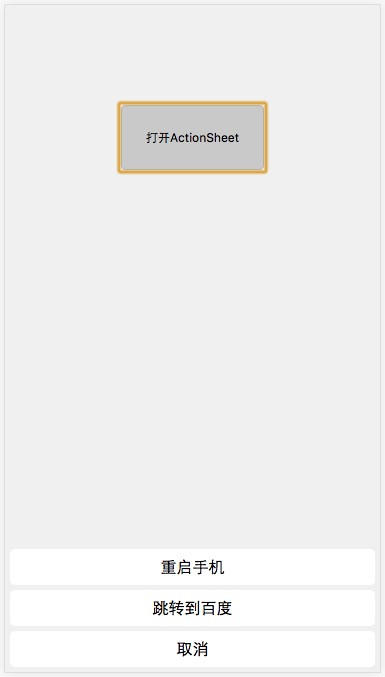

# action-sheet 

这是一个类似IOS中ActionSheet的按钮组控件。



[demo](https://hapjs.github.io/action-sheet/)

除了构造函数ActionSheet以外，它包含以下实例方法：

* [show](#show)
* [hide](#hide)
* [update](#update)

## 安装

如果在Node.js环境中使用，通过以下命令安装它。

```bash
npm i -DS action-sheet
```

[npm](https://www.npmjs.com/package/action-sheet)

## 引用

### 标签引入：

```html
<script src="https://raw.githubusercontent.com/hapjs/action-sheet/master/build/action-sheet.min.js"></script>
```

如果通过script方式引入，你可以通过全局变量`ActionSheet`来调用它。


### CommonJS/CMD/AMD引入：

```js
var ActionSheet = require('action-sheet');
```

### ES6引入：

```js
import ActionSheet from 'action-sheet';
```

## 创建ActionSheet

```js
var as = new ActionSheet({
    buttons: {
        '点我': function(e){
            // 点击按钮的回调事件
        },
        '百度': 'http://baidu.com/', // 点击按钮跳转链接
    }
});
```

## show

显示已经创建的ActionSheet实例

```js
as.show();
```

## hide

隐藏

```js
as.hide();
```

## update

更新按钮组内容

```js
as.update({
    '重启手机': function(e){
        // 点击按钮的回调事件
    },
    '立即关机': function(e){
        // 点击按钮的回调事件
    }
});
```
